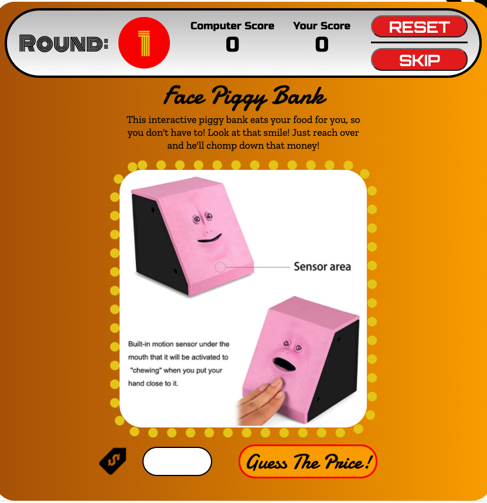

# Welcome to The Price is Right! *Virtual Amazon Rendition!*

# Summary of Virtual TPIR:
"The Price is Right" TV show is a timeless, unbelivably successful classic TV gameshow.  One that many of us have watched growing up who are familiar with its cheesy, but nostalgic theme and format.  As many have had the **deep, burning** desire to be on this show, but don't have the guts to have their mugshot on display on national television, here is a chance to join in on the fun price guessing game!  Except, in this version you won't actually win anything besides a cute, little: "You Won!" HTML pop-up display message. (Which may or may not be an indictor that you spend way too much time on Amazon.com)  

The other differences between this virtual version and the Bob Barker classic is all of these products will be **actual** products currently listed from Amazon.com!  If you're like me, when you look on Amazon, you're scouring it for the cheapest version of what ever you're searching for, AS well as consumer ratings, Prime or Not Prime, product weight, etc, etc!  So, this version we're stepping it up a notch by adding a few more value sets from the product, therefore increasing game play options as well as complexity!  Fun!!

# Rules and Game Play

### Main Game Play: You vs. Computer

1. This virtual version of TPIR gameplay is simple, straightforward and fun!  You'll be given a product off of amazon, at random, and you will be guessing on 3 different value types of that product: **Price**, **Rating**, and **Weight**. There is an input bar at the bottom of the page where you will input your value for each sub round.  

2. You are awarded points based on how close your guess is to the actual value on each of those categories.  The only Caveat being you have to guess the exact value, under, or within 50% of the actual value to be awarded points.   Remember overbidding or guessing OVER the real value will result in **negative** points! 

3. Your opponent will be the computer itself!  Its pretty smart and has plenty of resources at its disposal to guess correctly, but its not perfect!  Sometimes human intuition is simply just better than technology! 

4. **Winner or loser**  If you've out guessed the computer in all three rounds, and your score is subsequently higher than the computer YOU WIN!  If not, then thats ok, too you probably save money better than most and shouldn't know the price of a torx set from craftsman!

## How to Play

1. Upon loading the gameplay page, a product will automatically load with details about it, including a photo.

2. The first item to guess on is Price.  In field at the bottom input your best guess of price of the item, then click the button on the right.  Note: You may put decimals for cents, and we encourage you to try to guess as accurately as possible!

3. Next you'll have to guess the Amazon rating out of 5.  So, its easier to not go over here, don't put anything above 5!  Hint: most items on amazon have a pretty good rating, so shoot higher than you'd think!

4. Finally you'll have to guess on what you think the product weighs in LBS.  Here, for items that seem very light, put in decimals (or fractions) of a pound.  Hint:  1 ounce is .0625 of a Lb which is roughly equatable to a pencil or a slice of bread.  

5. **skipping** There is a skip button at the top right of the screen.  This allows you to skip to another item if you feel like you cannot guess close. 
There's a catch.... you get one "free" skip per game, meaning no penalty.  If you decide to skip a second or third time, you will have to give the computer 15 of your points!

