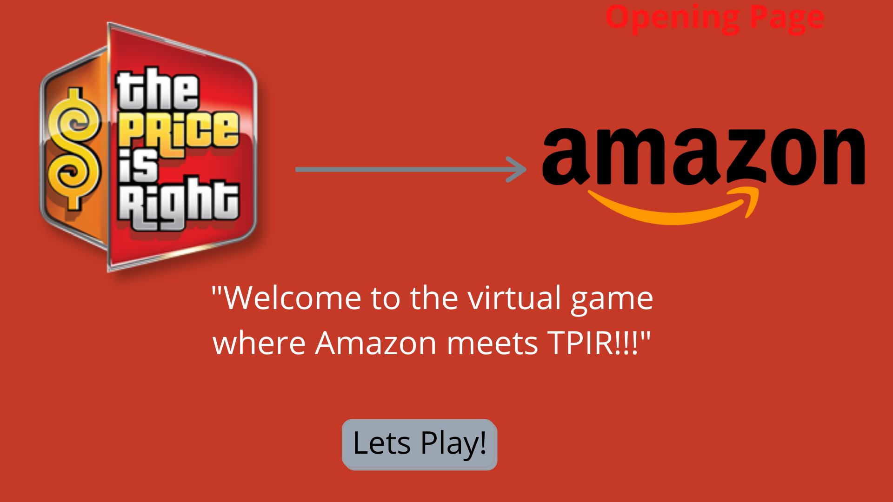
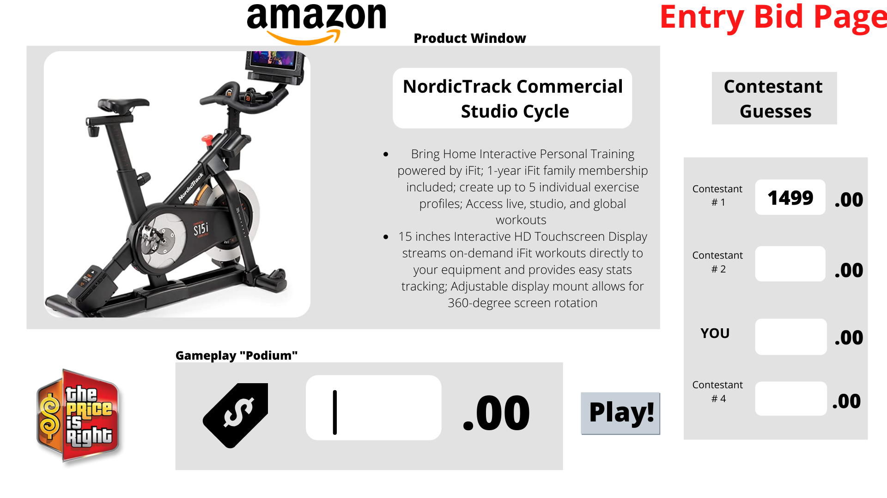
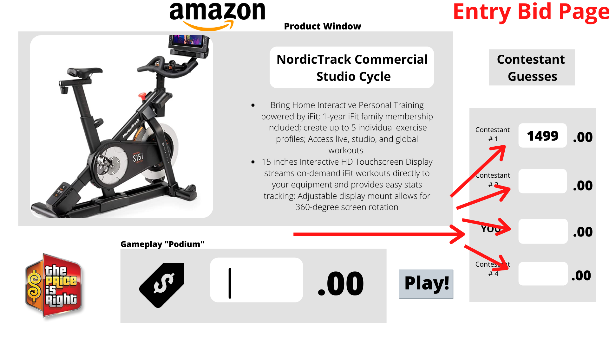
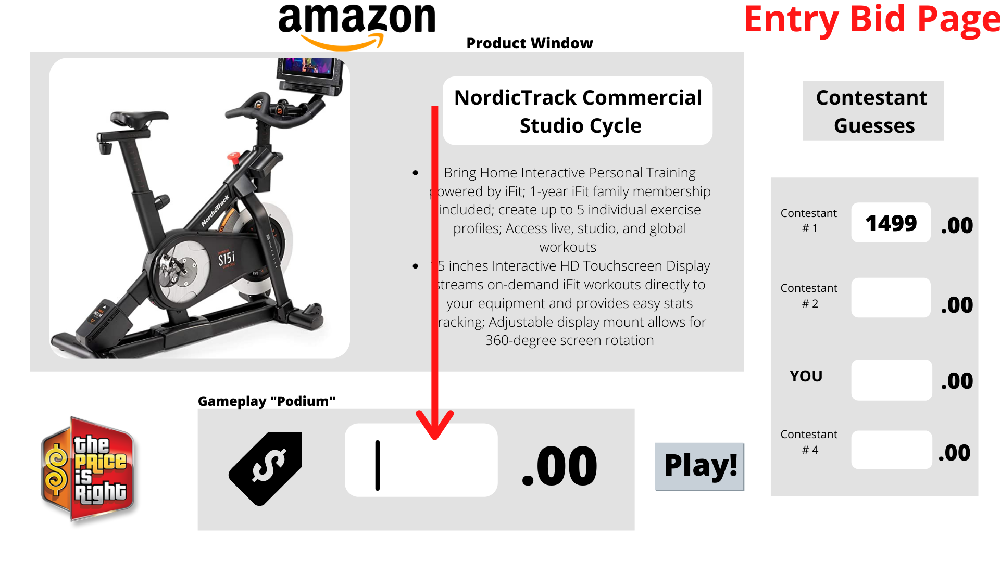
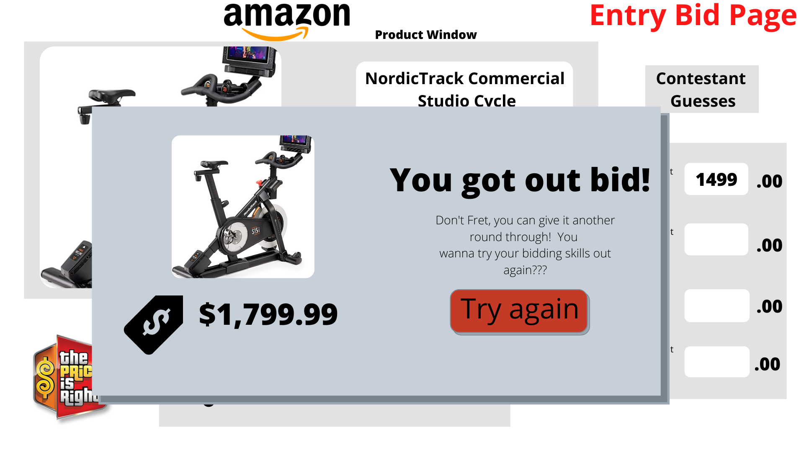
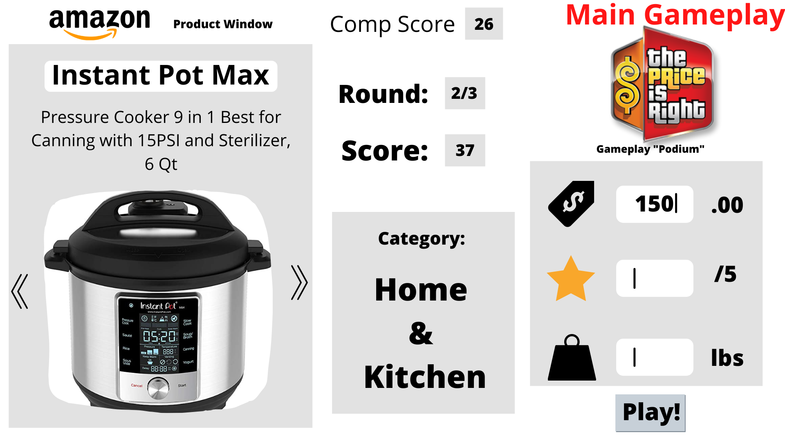
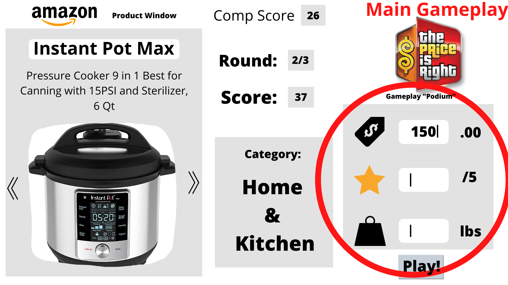
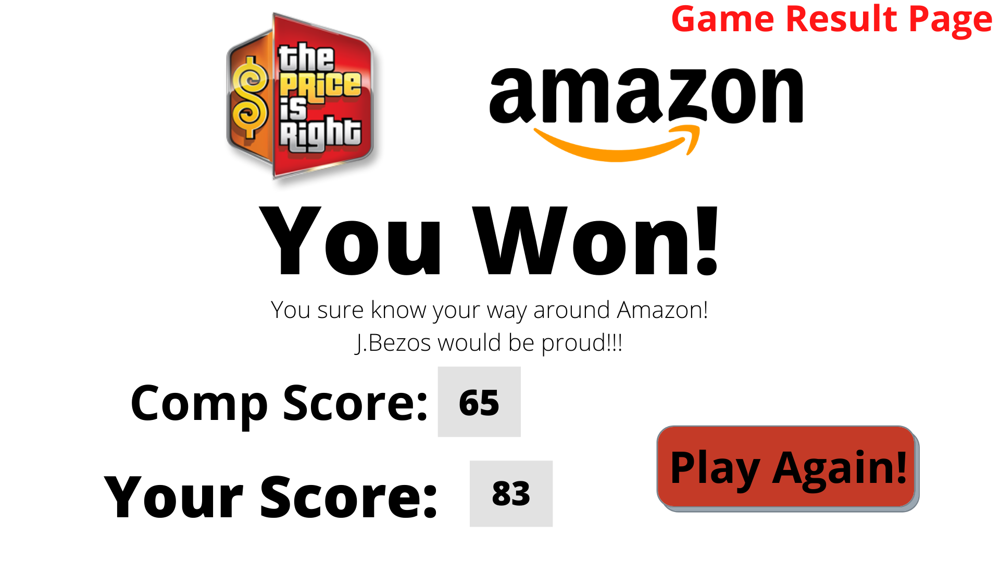
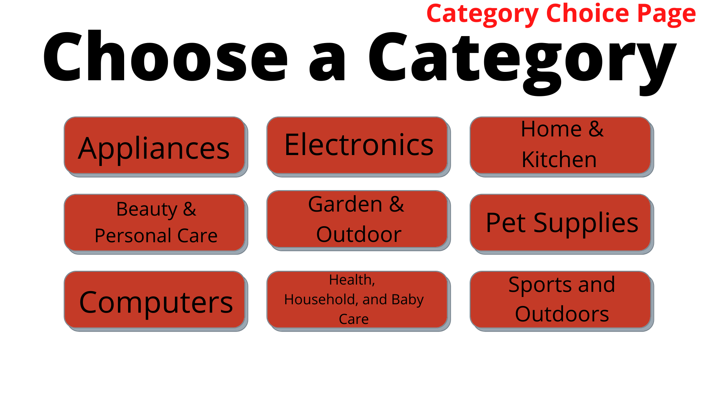

# The Price is Right! *Virtual Amazon Rendition!*

## Summary of Virtual TPIR:
"The Price is Right" TV show is a timeless, unbelivably successful classic TV gameshow.  One that many of us have watched growing up who are familiar with its cheesy, but nostalgic theme and format.  As many have had the **deep, burning** desire to be on this show, but don't have the guts to have their mugshot on display on national television, here is a chance to join in on the fun price guessing game!  Except, in this version you won't actually win anything besides a cute, little: "You Won!" HTML pop-up display message. (Which may or may not be an indictor that you spend way too much time on Amazon.com)  

The other differences between this virtual version and the Bob Barker classic is all of these products will be **actual** products currently listed from Amazon.com!  If you're like me, when you look on Amazon, you're scouring it for the cheapest version of what ever you're searching for, AS well as consumer ratings, Prime or Not Prime, product weight, etc, etc!  So, this version we're stepping it up a notch by adding a few more value sets from the product, therefore increasing game play options as well as complexity!  Fun!!

## Rules and Game Play

### 1. Entry into game: You vs. Computer (strech goal)
The very first portion of the game acts just like classic TPIR where you are essentially a member of the audience that was randomnly chosen to bid against 4 other players.  A product is listed and you must guess the price of it, closer than what the computer or 3 other players will guess, but without going over the actual retail price.  Once you've beat the computer, you advance to the next round!

### 2. Main Game Play: You vs. Computer again (MVP)
If you've advanced past the first round, now you'll get to play the main game (pre-chosen for the purposes of this game, MVP)  It consists of 3 seperate rounds against the computer, once again,except each round will represent a product from a different category of items.  (i.e. household items, tools & car parts, etc.)  The product that will appear will be a real product off of Amazon.com and you will have access to the photos given on Amazon.  From those photos and the product description, you will have to guess multiple values about that product other than just price.  Such as: price, review rating, and item weight.

Each category you guess on the computer is also guessing against you to guess the closest to the real answer.  The closer you are to the correct value, the higher the points that are awareded to you. 

### 3. Winner Winner Chicken Dinner!
If you've out guessed the computer in all three rounds, and your score is subsequently higher than the computer YOU WIN!  If not, then thats ok, too you probably save money better than most and shouldn't know the price of a torx set from craftsman!

## User Stories 

1. When a user first enters into the game, they are prompted to enter into the game via a button. (Stretch Goal)

2. Upon clicking the button, the following screen is the game entry page.  There is a main window that auto populates with a product, a product description as well as a photo of the item.  (Strech Goal)

3. The user will bid against 3 other "contestants" who are represented but computer AI, in a specific bidding order.  (The bidding order is chosen at random) (Strech Goal)

4. There is an entry field at the bottom center of the screen where a user will enter in their guess of the price of the item shown on the screen.  The button near the entry field called "play" will not activate unless it is their turn to bid according to the bid order shown on the small window on the right of the page, which also reveals what every other contestants bid is previous to thiers. (Strech Goal)
 

5. Upon entering a bid amount when it is their turn, and after all subsuquent bidding has ended for all contestants, a pop up will reveal the actual price of the item along with if they have successfully made it to the next round. If they have not succesfully out bid the computer/AIs then they will not be able to successfully make it to the following round.  Within that pop up display, a button will be available to try again before making it to the following round. (Strech Goal)

6. If the user *has* successfully outbid the AI, the pop up message will display momentarliy and automaticallhy bring them to the main game play page. (Strech Goal)

7. Upon entering into this page, where three separate rounds will take place, there is a game play "podium" on the right side that has three entry fields that are annotaed with a dollar sign, a star and a weight symbol.   Each one of these represents a value for a product they will have to be guessing on.  Directly below that is a button annoted by "Play"; this button the user will use once they have entered their guess choices into the fields successfully.  The button will not activate unless there is information in the fields. (MVP)

8. On the left there is a product window that will display the name of the item, the description of the item as well as a photo of the item.  This is the item that will be guessed on.  (MVP)

9. In the upper center of the page there will be a field that will track the number of points the user has accumulated, as well as the computer opponenent; and it will show at what current round the user is at in that given moment.  By which, at the end of each round, a new product is automatically populated in the product window, the scores are tallied and the round is adjusted to reflect the current round. (MVP)

10.  After the three subsequent rounds have concluded, a new page will appear revealing who the winner is along with the tallied scores left over from each round.  Lastly, there will also be a "Play Again" button that will return the user back to the original page to begin playing again. (MVP)

## MVP checklist: 

1. Main Game Play Page:  
    1.a. An area where a photo, and related data can populate where the user and computer will be guessing on the subsequent related data of the product in question.   These products will be stored locally and chosen at random at the time of the game.  

    2.a.  An area and fields where the user can enter in their choices for their guess along with a button that will submit their choices.  

    3.a. Absolute MVP bare minimum would require only one round of the game to play, not all other rounds.  But at the end of this round a winner must be declared, therefore a score must be tallied as well as an AI choice to compare against the user as well.  

2. Winner/loser pop-up: Upon completion of the singular round, and a winner is declared, an absolute MVP bare minimum would require a small pop-up window to appear that revealed who the winner is and a message displaying it.  Along with a reset or "play again" button to start the game back over again.  

## Strech Goals: 

1. Add the functionality of having multiple rounds in the main gameplay area.  This would allow for a more complex game to ensue as well as making it more challenging for the user.  

2. Adding in entry bid page that determins whether or not the user makes it to the main game play triple-round.  This will add an additional layer of complexity to the gameplay itself, as well as make it longer to complete.  

3. Adding on a start page that has a "start" button that redirects to either the main game play area OR, the entry bid page.  This would make a face for the game once for any user first entering into the game.  Styling and looks can be tweaked and maximized here. 

4. Adding in a "categories" functionality where the user can choose specific categories of products off of Amazon.com to play on.  This page would take place after the user has successfully made it passed the entry bid page, OR directly from the start page.  Each one of these categories will then take the user to the main game play page where they will begin the three round process against the computer.

   (Example shown below)

        4a. Additional strech goal related to this:  To add a button to the main game play page and functionality where a user may be able to "skip" a product as a way to get an advantage.  They could be redirected to this page of buttons where they would choose a different category and a random product would then populate in place of the previous one.  Of course it would come a price of their total tallied points as well.

